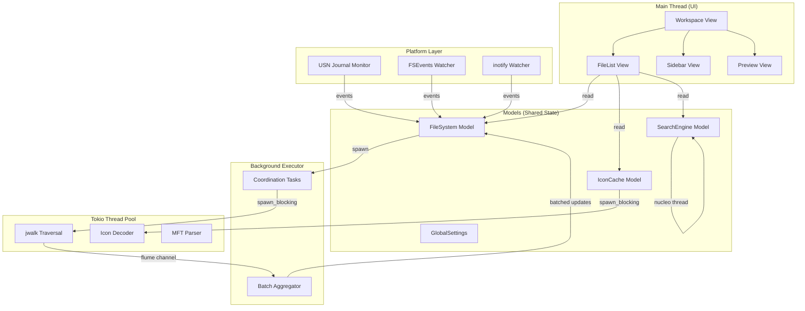

# Design Document

## Overview

This design document describes the architecture for a high-performance file explorer built with Rust and GPUI. The system follows an aggressive decoupling philosophy where the UI never waits for the file system. Instead, the file system is treated as an eventually consistent database with the UI reflecting current known state while background workers reconcile with the physical disk.

The architecture leverages:
- GPUI's entity-component ownership model for reactive UI updates
- A hybrid threading model separating UI, coordination, and heavy I/O
- Platform-specific acceleration (NTFS USN Journal, FSEvents, inotify)
- Virtualized rendering for handling millions of files
- Async icon loading with GPU texture management
- Nucleo-powered fuzzy search with incremental indexing

## Architecture



### Threading Model

| Thread | Responsibility | Max Operation Time |
|--------|---------------|-------------------|
| Main Thread | UI rendering, event dispatch, state coordination | 8ms |
| Background Executor | Light async coordination, channel management | 16ms |
| Tokio Pool | Heavy I/O (jwalk, icon decode, MFT parse) | Unbounded |
| Nucleo Thread | Fuzzy matching (managed by nucleo crate) | Unbounded |

### Data Flow Pipeline

1. User action triggers `FileSystem::load_path(path)`
2. FileSystem increments `request_id` (generational tracking)
3. Task dispatched to Background Executor
4. Executor offloads traversal to Tokio pool via `spawn_blocking`
5. jwalk streams results through `flume::Sender`
6. Batch aggregator collects items (100 items OR 16ms timeout)
7. Batched `Vec<FileEntry>` sent to UI thread
8. FileSystem validates `request_id`, updates model
9. GPUI automatically schedules re-render of observing Views

## Components and Interfaces

### Core Entities

```rust
/// Root container managing layout panes
pub struct Workspace {
    file_system: Model<FileSystem>,
    icon_cache: Model<IconCache>,
    search_engine: Model<SearchEngine>,
    file_list: View<FileList>,
    sidebar: View<Sidebar>,
    preview: Option<View<Preview>>,
}

/// Central file system state and I/O coordination
pub struct FileSystem {
    current_path: PathBuf,
    entries: Vec<FileEntry>,
    state: LoadState,
    request_id: usize,
    cache: LruCache<PathBuf, CachedDirectory>,
    watcher: Option<Box<dyn Watcher>>,
}

/// Single file or directory entry
pub struct FileEntry {
    pub name: String,
    pub path: PathBuf,
    pub is_dir: bool,
    pub size: u64,
    pub modified: SystemTime,
    pub file_type: FileType,
    pub icon_key: IconKey,
}

/// GPU texture management with LRU eviction
pub struct IconCache {
    textures: HashMap<IconKey, RenderImage>,
    lru: LruCache<IconKey, ()>,
    pending: HashSet<IconKey>,
    atlas: TextureAtlas,
    max_vram_bytes: usize,
}

/// Nucleo fuzzy search wrapper
pub struct SearchEngine {
    nucleo: Nucleo<PathBuf>,
    injector: Injector<PathBuf>,
    pattern: String,
    active: bool,
}
```

### Key Interfaces

```rust
/// FileSystem public interface
impl FileSystem {
    pub fn load_path(&mut self, path: PathBuf, cx: &mut ModelContext<Self>);
    pub fn navigate_up(&mut self, cx: &mut ModelContext<Self>);
    pub fn refresh(&mut self, cx: &mut ModelContext<Self>);
    pub fn entries(&self) -> &[FileEntry];
    pub fn current_path(&self) -> &Path;
    pub fn state(&self) -> LoadState;
}

/// IconCache public interface
impl IconCache {
    pub fn get_icon(&self, key: &IconKey) -> Option<&RenderImage>;
    pub fn request_icon(&mut self, key: IconKey, cx: &mut ModelContext<Self>);
    pub fn get_or_default(&self, key: &IconKey) -> &RenderImage;
}

/// SearchEngine public interface
impl SearchEngine {
    pub fn set_pattern(&mut self, pattern: &str, cx: &mut ModelContext<Self>);
    pub fn snapshot(&self) -> SearchSnapshot;
    pub fn inject(&self, path: PathBuf);
    pub fn clear(&mut self);
}

/// ListDelegate for virtualized rendering
impl ListDelegate for FileListDelegate {
    fn item_count(&self) -> usize;
    fn render_item(&self, ix: usize, cx: &mut ViewContext<FileList>) -> AnyElement;
}
```

### Platform Abstraction

```rust
/// Platform-specific file system operations
pub trait PlatformFs: Send + Sync {
    fn create_watcher(&self) -> Box<dyn Watcher>;
    fn supports_mft_index(&self) -> bool;
    fn build_mft_index(&self) -> Option<MftIndex>;
}

/// File system change watcher
pub trait Watcher: Send {
    fn watch(&mut self, path: &Path) -> Result<()>;
    fn unwatch(&mut self, path: &Path) -> Result<()>;
    fn poll_events(&mut self) -> Vec<FsEvent>;
}

/// Windows-specific MFT index
pub struct MftIndex {
    files: HashMap<FileReferenceNumber, FileNode>,
    usn_cursor: u64,
}
```

## Data Models

### FileEntry

| Field | Type | Description |
|-------|------|-------------|
| name | String | File or directory name |
| path | PathBuf | Absolute path |
| is_dir | bool | True if directory |
| size | u64 | Size in bytes (0 for directories) |
| modified | SystemTime | Last modification time |
| file_type | FileType | Detected file type for icon selection |
| icon_key | IconKey | Key for IconCache lookup |

### LoadState

```rust
pub enum LoadState {
    Idle,
    Loading { request_id: usize },
    Loaded { count: usize, duration: Duration },
    Error { message: String },
    Cached { stale: bool },
}
```

### CachedDirectory

| Field | Type | Description |
|-------|------|-------------|
| entries | Vec<FileEntry> | Cached file entries |
| generation | usize | Request ID when cached |
| timestamp | Instant | When cache was populated |
| mtime | SystemTime | Directory mtime for staleness check |

### FsEvent

```rust
pub enum FsEvent {
    Created(PathBuf),
    Modified(PathBuf),
    Deleted(PathBuf),
    Renamed { from: PathBuf, to: PathBuf },
}
```

### IconKey

```rust
#[derive(Hash, Eq, PartialEq, Clone)]
pub enum IconKey {
    Directory,
    GenericFile,
    Extension(String),
    MimeType(String),
    Custom(PathBuf),
}
```

### SearchSnapshot

| Field | Type | Description |
|-------|------|-------------|
| matches | Vec<MatchedItem> | Matched items with scores |
| pattern | String | Current search pattern |
| total_items | usize | Total items in index |

### MatchedItem

| Field | Type | Description |
|-------|------|-------------|
| index | usize | Index into original entries |
| score | u32 | Match score (higher is better) |
| positions | Vec<usize> | Character positions that matched |


## Correctness Properties

*A property is a characteristic or behavior that should hold true across all valid executions of a system-essentially, a formal statement about what the system should do. Properties serve as the bridge between human-readable specifications and machine-verifiable correctness guarantees.*

### Property 1: Loading State Consistency

*For any* FileSystem model transitioning to a loading state, the `state` field SHALL be `LoadState::Loading` with a valid `request_id` until the operation completes or is superseded.

**Validates: Requirements 1.2**

### Property 2: Batch Size Bounds

*For any* stream of N file entries from directory traversal, the number of batch updates delivered to the UI SHALL be at most `ceil(N / 100) + 1` (accounting for time-based flushes).

**Validates: Requirements 1.3, 3.3**

### Property 3: Cache Hit Returns Cached Data

*For any* path that exists in the LRU cache, calling `load_path` SHALL immediately make cached entries available via `entries()` before any async operation completes.

**Validates: Requirements 1.4**

### Property 4: Generational ID Monotonicity and Validation

*For any* sequence of N navigation requests, each request SHALL receive a strictly increasing `request_id`, and only results matching the current `request_id` SHALL be applied to the model state.

**Validates: Requirements 1.5, 8.1, 8.2, 8.3**

### Property 5: Virtualization Bounds

*For any* file list with N total items, viewport height H, and row height R, the number of rendered items SHALL be at most `ceil(H / R) + buffer_size`, regardless of N.

**Validates: Requirements 2.1**

### Property 6: Rendered Entry Completeness

*For any* FileEntry, the rendered representation SHALL contain the file name, formatted size, formatted modification date, and an icon reference.

**Validates: Requirements 2.3**

### Property 7: Visible Range Calculation

*For any* viewport height H, row height R, scroll offset S, and total items N, the calculated visible range `[start, end)` SHALL satisfy: `start = floor(S / R)`, `end = min(start + ceil(H / R) + buffer, N)`.

**Validates: Requirements 2.4**

### Property 8: Traversal Results Sorted

*For any* directory traversal result, the delivered entries SHALL be sorted by the configured sort key (name, size, or date) in the configured order (ascending or descending).

**Validates: Requirements 3.2**

### Property 9: Icon Cache Miss Returns Default

*For any* IconKey not present in the cache, `get_or_default` SHALL return the default placeholder icon AND add the key to the pending fetch set.

**Validates: Requirements 4.1**

### Property 10: RGBA to BGRA Conversion

*For any* pixel with RGBA values (r, g, b, a), the BGRA conversion SHALL produce (b, g, r, a), preserving alpha and swapping red/blue channels.

**Validates: Requirements 4.2**

### Property 11: Icon Fetch Completion Updates Cache

*For any* completed icon fetch for key K, the cache SHALL contain the decoded texture for K AND K SHALL be removed from the pending set.

**Validates: Requirements 4.3**

### Property 12: LRU Eviction Bounds Cache Size

*For any* sequence of icon insertions, when cache size exceeds `max_entries`, the least recently accessed icons SHALL be evicted until size is within bounds.

**Validates: Requirements 4.4**

### Property 13: Search Pattern Update

*For any* pattern string P, after calling `set_pattern(P)`, the SearchEngine's internal pattern state SHALL equal P.

**Validates: Requirements 5.1**

### Property 14: Match Positions Validity

*For any* MatchedItem with positions array, each position SHALL be a valid index into the matched file name string (0 <= pos < name.len()).

**Validates: Requirements 5.2**

### Property 15: Injected Items Searchable

*For any* path P injected into the SearchEngine, a subsequent search with a pattern matching P's filename SHALL include P in the results.

**Validates: Requirements 5.5**

### Property 16: File Event Updates Entries

*For any* FsEvent::Created(path) received while monitoring, the FileSystem entries SHALL contain an entry for path after processing. *For any* FsEvent::Deleted(path), the entries SHALL NOT contain path after processing.

**Validates: Requirements 6.4**

### Property 17: Event Coalescing

*For any* sequence of N events on the same path within a coalescing window, the number of UI updates triggered SHALL be less than N.

**Validates: Requirements 6.5**

### Property 18: MFT Index Path Reconstruction

*For any* FileReferenceNumber in the MFT index, path reconstruction SHALL produce a valid absolute path by traversing parent references to the root.

**Validates: Requirements 7.1, 7.2**

### Property 19: MFT Index Event Consistency

*For any* USN create event for path P, the MFT index SHALL contain an entry for P after processing. *For any* USN delete event for path P, the index SHALL NOT contain P after processing.

**Validates: Requirements 7.3**

### Property 20: Cache Generation Stored

*For any* CachedDirectory, the `generation` field SHALL equal the `request_id` that was active when the cache entry was created.

**Validates: Requirements 8.4**

### Property 21: FileEntry Serialization Round-Trip

*For any* valid FileEntry, serializing then deserializing SHALL produce an equivalent FileEntry with identical field values.

**Validates: Requirements 10.1, 10.4**

### Property 22: Corrupted Data Rejection

*For any* byte sequence that is not a valid serialized format, deserialization SHALL return an error rather than producing an invalid or partial structure.

**Validates: Requirements 10.2**

### Property 23: MFT Index Serialization Round-Trip

*For any* valid MftIndex, serializing then deserializing SHALL produce an equivalent index with identical file mappings.

**Validates: Requirements 10.3, 10.4**

## Error Handling

### Error Categories

| Category | Examples | Handling Strategy |
|----------|----------|-------------------|
| I/O Errors | Permission denied, path not found | Display error in UI, offer retry |
| Serialization Errors | Corrupted cache, version mismatch | Discard cache, rebuild from disk |
| Platform Errors | USN Journal unavailable, FSEvents failure | Fall back to polling-based monitoring |
| Resource Exhaustion | VRAM limit, file handle limit | LRU eviction, graceful degradation |

### Error Propagation

```rust
#[derive(Debug, thiserror::Error)]
pub enum FileSystemError {
    #[error("I/O error: {0}")]
    Io(#[from] std::io::Error),
    
    #[error("Path not found: {0}")]
    PathNotFound(PathBuf),
    
    #[error("Permission denied: {0}")]
    PermissionDenied(PathBuf),
    
    #[error("Serialization error: {0}")]
    Serialization(#[from] bincode::Error),
    
    #[error("Platform error: {0}")]
    Platform(String),
}

pub type Result<T> = std::result::Result<T, FileSystemError>;
```

### Recovery Strategies

1. **Cache Corruption**: Delete cache file, rebuild index on next access
2. **Watcher Failure**: Fall back to manual refresh, notify user
3. **Icon Decode Failure**: Use generic file icon, log warning
4. **MFT Parse Failure**: Disable instant search, use standard traversal

## Testing Strategy

### Property-Based Testing Framework

We use `proptest` as the property-based testing library for Rust. Each correctness property will be implemented as a proptest that generates random inputs and verifies the property holds.

```toml
[dev-dependencies]
proptest = "1.4"
```

### Test Configuration

- Minimum iterations per property: 100
- Shrinking enabled for counterexample minimization
- Seed logging for reproducibility

### Unit Tests

Unit tests cover specific examples and edge cases:

- Empty directory handling
- Single file directory
- Directory with exactly 100 items (batch boundary)
- Unicode file names
- Very long path names
- Files with zero size
- Files with future modification dates

### Property-Based Tests

Each correctness property maps to a proptest:

| Property | Generator Strategy |
|----------|-------------------|
| Batch Size Bounds | Generate Vec<FileEntry> of random size 0-10000 |
| Generational ID | Generate sequence of navigation requests |
| Virtualization Bounds | Generate (total_items, viewport_height, row_height) |
| RGBA to BGRA | Generate random (u8, u8, u8, u8) tuples |
| LRU Eviction | Generate sequence of (insert, access) operations |
| Serialization Round-Trip | Generate arbitrary FileEntry/MftIndex |
| Match Positions | Generate (filename, pattern) pairs |

### Integration Tests

- Full navigation flow: click folder → load → display
- Search flow: type pattern → results update → select result
- Icon loading flow: request → fetch → cache → display
- File monitoring flow: external change → event → UI update

### Test Annotations

All property-based tests will be annotated with:
```rust
// **Feature: file-explorer-core, Property {N}: {property_text}**
// **Validates: Requirements X.Y**
```
