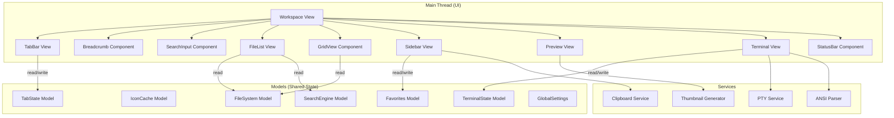

# Design Document

## Overview

This design document describes the architecture for UI enhancements to the Nexus Explorer file manager. The enhancements focus on making existing UI elements functional (search, breadcrumbs, sorting, sidebar favorites, grid view) and adding new capabilities (integrated terminal, file preview, tools section, tab management).

The design follows GPUI's entity-component model and integrates with the existing FileSystem, IconCache, and SearchEngine models. New components will be added for Terminal, Preview, TabBar, and enhanced Sidebar functionality.

## Architecture



### Component Responsibilities

| Component | Responsibility |
|-----------|---------------|
| TabBar | Manages multiple directory tabs, tab switching, close buttons |
| Breadcrumb | Renders clickable path segments, handles navigation |
| SearchInput | Captures search queries, triggers filtering |
| FileList | List view rendering with sorting, selection |
| GridView | Grid view rendering with thumbnails |
| Sidebar | Favorites management, drag-drop, workspace tree |
| Preview | File content preview, metadata display |
| Terminal | PTY integration, ANSI rendering, input handling |
| StatusBar | Item counts, view toggle, terminal toggle, git branch |

## Components and Interfaces

### SearchInput Component

```rust
pub struct SearchInput {
    query: String,
    is_focused: bool,
    placeholder: String,
}

impl SearchInput {
    pub fn new() -> Self;
    pub fn query(&self) -> &str;
    pub fn set_query(&mut self, query: String);
    pub fn clear(&mut self);
    pub fn is_empty(&self) -> bool;
}
```

### Breadcrumb Component

```rust
pub struct Breadcrumb {
    segments: Vec<PathSegment>,
    max_visible: usize,
    show_ellipsis_menu: bool,
}

pub struct PathSegment {
    name: String,
    path: PathBuf,
    is_root: bool,
}

impl Breadcrumb {
    pub fn from_path(path: &Path) -> Self;
    pub fn segments(&self) -> &[PathSegment];
    pub fn visible_segments(&self) -> Vec<&PathSegment>;
    pub fn hidden_segments(&self) -> Vec<&PathSegment>;
    pub fn path_for_segment(&self, index: usize) -> Option<&Path>;
}
```

### SortState

```rust
#[derive(Clone, Copy, PartialEq, Eq)]
pub enum SortColumn {
    Name,
    Date,
    Type,
    Size,
}

#[derive(Clone, Copy, PartialEq, Eq)]
pub enum SortDirection {
    Ascending,
    Descending,
}

pub struct SortState {
    column: SortColumn,
    direction: SortDirection,
    directories_first: bool,
}

impl SortState {
    pub fn new() -> Self;
    pub fn toggle_column(&mut self, column: SortColumn);
    pub fn sort_entries(&self, entries: &mut [FileEntry]);
}
```

### Favorites Model

```rust
pub struct Favorite {
    pub name: String,
    pub path: PathBuf,
    pub icon: IconKey,
    pub is_valid: bool,
}

pub struct Favorites {
    items: Vec<Favorite>,
    max_count: usize,
}

impl Favorites {
    pub fn new() -> Self;
    pub fn add(&mut self, path: PathBuf) -> Result<(), FavoritesError>;
    pub fn remove(&mut self, index: usize);
    pub fn reorder(&mut self, from: usize, to: usize);
    pub fn items(&self) -> &[Favorite];
    pub fn validate_all(&mut self);
    pub fn save(&self) -> Result<()>;
    pub fn load() -> Result<Self>;
}

pub enum FavoritesError {
    MaxReached,
    AlreadyExists,
    InvalidPath,
}
```

### ViewMode

```rust
#[derive(Clone, Copy, PartialEq, Eq)]
pub enum ViewMode {
    List,
    Grid,
}

pub struct GridConfig {
    pub icon_size: f32,      // 64.0
    pub item_width: f32,     // 96.0
    pub item_height: f32,    // 88.0
    pub gap: f32,            // 8.0
}

impl GridConfig {
    pub fn columns_for_width(&self, width: f32) -> usize;
}
```

### TabState Model

```rust
pub struct Tab {
    pub id: TabId,
    pub path: PathBuf,
    pub title: String,
    pub needs_refresh: bool,
    pub scroll_position: f32,
    pub selection: Option<usize>,
}

pub struct TabState {
    tabs: Vec<Tab>,
    active_index: usize,
    next_id: TabId,
}

impl TabState {
    pub fn new(initial_path: PathBuf) -> Self;
    pub fn open_tab(&mut self, path: PathBuf) -> TabId;
    pub fn close_tab(&mut self, id: TabId);
    pub fn switch_to(&mut self, id: TabId);
    pub fn active_tab(&self) -> &Tab;
    pub fn active_tab_mut(&mut self) -> &mut Tab;
    pub fn tabs(&self) -> &[Tab];
    pub fn tab_count(&self) -> usize;
}
```

### TerminalState Model

```rust
pub struct TerminalState {
    lines: Vec<TerminalLine>,
    cursor: CursorPosition,
    scroll_offset: usize,
    working_directory: PathBuf,
    is_running: bool,
}

pub struct TerminalLine {
    pub cells: Vec<TerminalCell>,
}

pub struct TerminalCell {
    pub char: char,
    pub style: CellStyle,
}

pub struct CellStyle {
    pub foreground: Rgba,
    pub background: Rgba,
    pub bold: bool,
    pub italic: bool,
    pub underline: bool,
}

pub struct CursorPosition {
    pub row: usize,
    pub col: usize,
}
```

### ANSI Parser

```rust
pub struct AnsiParser {
    state: ParserState,
    params: Vec<u16>,
    current_style: CellStyle,
}

impl AnsiParser {
    pub fn new() -> Self;
    pub fn parse(&mut self, input: &[u8]) -> Vec<ParsedSegment>;
    pub fn current_style(&self) -> &CellStyle;
}

pub enum ParsedSegment {
    Text(String, CellStyle),
    CursorMove(i32, i32),
    ClearLine,
    ClearScreen,
    SetTitle(String),
}
```

### Preview Component

```rust
pub enum PreviewContent {
    Text { content: String, language: Option<String>, line_count: usize },
    Image { path: PathBuf, dimensions: (u32, u32), format: String },
    HexDump { bytes: Vec<u8>, total_size: u64 },
    Directory { item_count: usize, total_size: u64, subdir_count: usize },
    Error { message: String },
    Loading,
    None,
}

pub struct FileMetadata {
    pub name: String,
    pub size: u64,
    pub file_type: String,
    pub modified: SystemTime,
    pub permissions: String,
}

pub struct Preview {
    content: PreviewContent,
    metadata: Option<FileMetadata>,
    scroll_offset: f32,
}

impl Preview {
    pub fn new() -> Self;
    pub fn load_file(&mut self, path: &Path);
    pub fn load_directory(&mut self, path: &Path);
    pub fn clear(&mut self);
}
```

### StatusBar Component

```rust
pub struct StatusBarState {
    pub total_items: usize,
    pub selected_count: usize,
    pub selected_size: u64,
    pub view_mode: ViewMode,
    pub git_branch: Option<String>,
    pub is_loading: bool,
    pub progress: Option<f32>,
}

impl StatusBarState {
    pub fn update_from_file_list(&mut self, entries: &[FileEntry], selection: &[usize]);
    pub fn detect_git_branch(&mut self, path: &Path);
}
```

### Theme System

```rust
#[derive(Clone, Copy, PartialEq, Eq, Hash, Serialize, Deserialize)]
pub enum ThemeId {
    // RPG-Inspired Themes
    DragonForge,      // Deep crimson, molten gold, obsidian blacks
    FrostHaven,       // Ice blues, silver, aurora greens
    ShadowRealm,      // Deep purples, ethereal glows, void blacks
    AncientTome,      // Parchment, leather browns, gold leaf
    ElvenGlade,       // Forest greens, moonlight silver, bark browns
    DwarvenHall,      // Stone grays, forge orange, copper accents
    
    // Modern Variants
    CyberpunkNeon,    // Hot pink, electric cyan, deep blacks
    TokyoMidnight,    // Neon signs on dark streets
    VoidTerminal,     // Pure dark with subtle glows
}

pub struct Theme {
    pub id: ThemeId,
    pub name: &'static str,
    pub description: &'static str,
    pub colors: ThemeColors,
    pub typography: ThemeTypography,
    pub decorations: ThemeDecorations,
}

pub struct ThemeTypography {
    // Display font for headers, titles (Playfair Display, Crimson Pro)
    pub font_display: &'static str,
    pub font_display_weight_light: u16,    // 200
    pub font_display_weight_bold: u16,     // 900
    
    // Body font for content (IBM Plex Sans, Source Sans 3)
    pub font_body: &'static str,
    pub font_body_weight_normal: u16,      // 400
    pub font_body_weight_medium: u16,      // 600
    
    // Monospace for code, terminal (JetBrains Mono, Fira Code)
    pub font_mono: &'static str,
    pub font_mono_weight: u16,
    
    // Size scale (using 3x jumps for impact)
    pub size_xs: f32,      // 10px - tiny labels
    pub size_sm: f32,      // 12px - secondary text
    pub size_base: f32,    // 14px - body text
    pub size_lg: f32,      // 18px - subheadings
    pub size_xl: f32,      // 24px - section headers
    pub size_2xl: f32,     // 36px - page titles
    pub size_3xl: f32,     // 48px - hero text
    
    // Letter spacing
    pub tracking_tight: f32,   // -0.02em for large text
    pub tracking_normal: f32,  // 0
    pub tracking_wide: f32,    // 0.05em for small caps
}

pub struct ThemeDecorations {
    // Border styles - avoid generic rounded corners
    pub border_radius_sm: f32,     // 4px - buttons, inputs
    pub border_radius_md: f32,     // 8px - cards, panels
    pub border_radius_lg: f32,     // 16px - modals, overlays
    pub border_width: f32,         // 1px standard, 2px emphasis
    
    // RPG Ornate elements - CRITICAL for fantasy aesthetic
    pub use_ornate_borders: bool,
    pub corner_flourish: Option<CornerFlourish>,  // Decorative corner elements
    pub divider_style: DividerStyle,
    pub frame_style: FrameStyle,   // Panel frame decoration
    
    // Shadows and depth - use colored shadows for atmosphere
    pub shadow_sm: ShadowConfig,   // Subtle elevation
    pub shadow_md: ShadowConfig,   // Cards, dropdowns
    pub shadow_lg: ShadowConfig,   // Modals, overlays
    pub shadow_glow: ShadowConfig, // Accent glow effect (colored!)
    pub shadow_inner: ShadowConfig,// Inset depth effect
    
    // Background effects - NEVER use plain solid colors
    pub bg_pattern: Option<BackgroundPattern>,
    pub bg_gradient: Option<GradientConfig>,
    pub bg_texture: Option<TextureConfig>,
    pub bg_noise_opacity: f32,     // Subtle noise overlay (0.02-0.05)
}

pub struct CornerFlourish {
    pub svg_path: &'static str,    // SVG path data for corner decoration
    pub size: f32,                 // Size in pixels (16-32px typical)
    pub color_mode: FlourshColorMode,
}

pub enum FlourshColorMode {
    Accent,           // Use accent_primary
    Border,           // Use border_ornate
    Gradient,         // Gradient from accent to transparent
}

pub enum FrameStyle {
    None,             // No frame
    Simple,           // Single border
    Double,           // Double-line border (medieval)
    Ornate,           // Decorative frame with corners
    Beveled,          // 3D beveled edge
    Inset,            // Carved inset effect
}

pub enum DividerStyle {
    Simple,           // Plain line
    Ornate,           // Decorative flourishes (═══❖═══)
    Gradient,         // Fading gradient from center
    Dashed,           // Dashed pattern
    Embossed,         // 3D embossed line
    Runic,            // Runic/mystical pattern
}

pub enum BackgroundPattern {
    None,
    Dots,             // Subtle dot grid
    Grid,             // Fine grid lines
    Noise,            // Subtle noise texture
    Geometric,        // Geometric shapes
    Parchment,        // Paper texture (Ancient Tome)
    Leather,          // Leather grain (Ancient Tome)
    Volcanic,         // Cracked lava pattern (Dragon Forge)
    Crystalline,      // Ice crystal pattern (Frost Haven)
    Mystical,         // Swirling void pattern (Shadow Realm)
    Organic,          // Vine/leaf pattern (Elven Glade)
}

pub struct GradientConfig {
    pub gradient_type: GradientType,
    pub stops: Vec<(f32, Rgba)>,   // Position (0-1) and color
    pub angle: f32,                // Degrees for linear
}

pub enum GradientType {
    Linear,
    Radial,
    Conic,
}

pub struct TextureConfig {
    pub texture_type: TextureType,
    pub opacity: f32,              // 0.02-0.1 for subtle effect
    pub blend_mode: BlendMode,
}

pub enum TextureType {
    Noise,            // Perlin/simplex noise
    Paper,            // Paper fiber texture
    Leather,          // Leather grain
    Metal,            // Brushed metal
    Stone,            // Stone surface
    Wood,             // Wood grain
}

pub enum BlendMode {
    Overlay,
    SoftLight,
    Multiply,
    Screen,
}

pub struct ShadowConfig {
    pub offset_x: f32,
    pub offset_y: f32,
    pub blur: f32,
    pub spread: f32,
    pub color: Rgba,              // Use theme colors, not black!
}

pub struct ThemeColors {
    // Backgrounds - layered depth
    pub bg_void: Rgba,         // Deepest background (0x050508)
    pub bg_primary: Rgba,      // Main content area
    pub bg_secondary: Rgba,    // Sidebar, panels
    pub bg_tertiary: Rgba,     // Cards, elevated surfaces
    pub bg_hover: Rgba,        // Interactive hover state
    pub bg_selected: Rgba,     // Selected items
    pub bg_active: Rgba,       // Active/pressed state
    
    // Text hierarchy
    pub text_primary: Rgba,    // Main content
    pub text_secondary: Rgba,  // Supporting text
    pub text_muted: Rgba,      // Disabled, hints
    pub text_inverse: Rgba,    // Text on accent backgrounds
    
    // Accent colors - dramatic, saturated
    pub accent_primary: Rgba,   // Main brand color
    pub accent_secondary: Rgba, // Complementary accent
    pub accent_glow: Rgba,      // Glow/highlight effect
    
    // Semantic colors
    pub success: Rgba,         // Emerald green
    pub warning: Rgba,         // Amber gold
    pub error: Rgba,           // Crimson red
    pub info: Rgba,            // Sapphire blue
    
    // Borders and dividers
    pub border_subtle: Rgba,   // Barely visible
    pub border_default: Rgba,  // Standard borders
    pub border_emphasis: Rgba, // Important boundaries
    pub border_ornate: Rgba,   // Decorative borders
    
    // File type colors (rich, distinctive)
    pub folder_color: Rgba,
    pub folder_open_color: Rgba,
    pub file_code: Rgba,
    pub file_data: Rgba,
    pub file_media: Rgba,
    pub file_archive: Rgba,
    pub file_document: Rgba,
    
    // Terminal colors (16-color palette)
    pub terminal_bg: Rgba,
    pub terminal_fg: Rgba,
    pub terminal_cursor: Rgba,
    pub terminal_selection: Rgba,
    pub terminal_black: Rgba,
    pub terminal_red: Rgba,
    pub terminal_green: Rgba,
    pub terminal_yellow: Rgba,
    pub terminal_blue: Rgba,
    pub terminal_magenta: Rgba,
    pub terminal_cyan: Rgba,
    pub terminal_white: Rgba,
}

pub struct ThemeManager {
    current: ThemeId,
    themes: HashMap<ThemeId, Theme>,
}

impl ThemeManager {
    pub fn new() -> Self;
    pub fn current_theme(&self) -> &Theme;
    pub fn set_theme(&mut self, id: ThemeId);
    pub fn available_themes(&self) -> Vec<&Theme>;
    pub fn save(&self) -> Result<()>;
    pub fn load() -> Result<Self>;
}

impl Theme {
    // RPG Themes
    pub fn dragon_forge() -> Self;    // Default - crimson & gold
    pub fn frost_haven() -> Self;     // Ice & aurora
    pub fn shadow_realm() -> Self;    // Ethereal purple
    pub fn ancient_tome() -> Self;    // Parchment & leather
    pub fn elven_glade() -> Self;     // Forest moonlight
    pub fn dwarven_hall() -> Self;    // Stone & forge
    
    // Modern Themes
    pub fn cyberpunk_neon() -> Self;
    pub fn tokyo_midnight() -> Self;
    pub fn void_terminal() -> Self;
}
```

### Quick Look Overlay

```rust
pub struct QuickLook {
    is_visible: bool,
    current_file: Option<PathBuf>,
    content: QuickLookContent,
    zoom_level: f32,
}

pub enum QuickLookContent {
    Image { data: ImageData, dimensions: (u32, u32) },
    Video { path: PathBuf, duration: Duration },
    Text { content: String, language: Option<String> },
    Document { rendered: Vec<u8> },
    Unsupported { file_type: String },
    Loading,
}

impl QuickLook {
    pub fn show(&mut self, path: PathBuf);
    pub fn hide(&mut self);
    pub fn toggle(&mut self, path: PathBuf);
    pub fn next(&mut self, entries: &[FileEntry], current_index: usize);
    pub fn previous(&mut self, entries: &[FileEntry], current_index: usize);
}
```

### File Operations Manager

```rust
pub struct FileOperation {
    pub id: OperationId,
    pub op_type: OperationType,
    pub sources: Vec<PathBuf>,
    pub destination: Option<PathBuf>,
    pub progress: OperationProgress,
    pub status: OperationStatus,
}

pub enum OperationType {
    Copy,
    Move,
    Delete,
    Compress,
    Extract,
}

pub struct OperationProgress {
    pub total_bytes: u64,
    pub transferred_bytes: u64,
    pub total_files: usize,
    pub completed_files: usize,
    pub current_file: Option<String>,
    pub speed_bytes_per_sec: u64,
    pub estimated_remaining: Duration,
}

pub enum OperationStatus {
    Pending,
    Running,
    Paused,
    Completed,
    Failed(String),
    Cancelled,
}

pub struct FileOperationsManager {
    operations: Vec<FileOperation>,
    undo_stack: Vec<UndoableOperation>,
    redo_stack: Vec<UndoableOperation>,
}

impl FileOperationsManager {
    pub fn copy(&mut self, sources: Vec<PathBuf>, dest: PathBuf) -> OperationId;
    pub fn move_files(&mut self, sources: Vec<PathBuf>, dest: PathBuf) -> OperationId;
    pub fn delete(&mut self, sources: Vec<PathBuf>) -> OperationId;
    pub fn cancel(&mut self, id: OperationId);
    pub fn undo(&mut self) -> Result<()>;
    pub fn redo(&mut self) -> Result<()>;
    pub fn can_undo(&self) -> bool;
    pub fn can_redo(&self) -> bool;
}
```

### Batch Rename

```rust
pub struct BatchRename {
    files: Vec<PathBuf>,
    pattern: String,
    preview: Vec<RenamePreview>,
    conflicts: Vec<usize>,
}

pub struct RenamePreview {
    pub original: String,
    pub new_name: String,
    pub has_conflict: bool,
}

pub enum RenameToken {
    Text(String),
    Counter { start: usize, padding: usize },
    Date { format: String },
    Extension,
    OriginalName,
}

impl BatchRename {
    pub fn new(files: Vec<PathBuf>) -> Self;
    pub fn set_pattern(&mut self, pattern: &str);
    pub fn set_find_replace(&mut self, find: &str, replace: &str);
    pub fn preview(&self) -> &[RenamePreview];
    pub fn has_conflicts(&self) -> bool;
    pub fn apply(&self) -> Result<Vec<PathBuf>>;
}
```

### Bookmarks

```rust
pub struct Bookmark {
    pub id: BookmarkId,
    pub name: String,
    pub path: PathBuf,
    pub shortcut: Option<KeyBinding>,
    pub icon: IconKey,
}

pub struct BookmarkManager {
    bookmarks: Vec<Bookmark>,
    recent_locations: VecDeque<PathBuf>,
    max_recent: usize,
}

impl BookmarkManager {
    pub fn add(&mut self, path: PathBuf) -> BookmarkId;
    pub fn remove(&mut self, id: BookmarkId);
    pub fn rename(&mut self, id: BookmarkId, name: String);
    pub fn set_shortcut(&mut self, id: BookmarkId, shortcut: KeyBinding);
    pub fn bookmarks(&self) -> &[Bookmark];
    pub fn recent(&self) -> &VecDeque<PathBuf>;
    pub fn add_recent(&mut self, path: PathBuf);
    pub fn save(&self) -> Result<()>;
    pub fn load() -> Result<Self>;
}
```

### File Tags

```rust
#[derive(Clone, Copy, PartialEq, Eq, Hash)]
pub enum TagColor {
    Red,
    Orange,
    Yellow,
    Green,
    Blue,
    Purple,
    Gray,
}

pub struct Tag {
    pub id: TagId,
    pub name: String,
    pub color: TagColor,
}

pub struct TagManager {
    tags: HashMap<TagId, Tag>,
    file_tags: HashMap<PathBuf, HashSet<TagId>>,
}

impl TagManager {
    pub fn create_tag(&mut self, name: String, color: TagColor) -> TagId;
    pub fn delete_tag(&mut self, id: TagId);
    pub fn apply_tag(&mut self, path: &Path, tag_id: TagId);
    pub fn remove_tag(&mut self, path: &Path, tag_id: TagId);
    pub fn tags_for_file(&self, path: &Path) -> Vec<&Tag>;
    pub fn files_with_tag(&self, tag_id: TagId) -> Vec<&PathBuf>;
    pub fn all_tags(&self) -> Vec<&Tag>;
    pub fn save(&self) -> Result<()>;
    pub fn load() -> Result<Self>;
}
```

### Dual Pane

```rust
pub struct DualPane {
    left: PaneState,
    right: PaneState,
    active: PaneSide,
    is_enabled: bool,
}

pub enum PaneSide {
    Left,
    Right,
}

pub struct PaneState {
    pub path: PathBuf,
    pub entries: Vec<FileEntry>,
    pub selection: Vec<usize>,
    pub scroll_offset: f32,
    pub sort_state: SortState,
}

impl DualPane {
    pub fn enable(&mut self);
    pub fn disable(&mut self);
    pub fn toggle(&mut self);
    pub fn switch_active(&mut self);
    pub fn active_pane(&self) -> &PaneState;
    pub fn active_pane_mut(&mut self) -> &mut PaneState;
    pub fn inactive_pane(&self) -> &PaneState;
    pub fn copy_to_other(&self) -> Vec<PathBuf>;
    pub fn move_to_other(&self) -> Vec<PathBuf>;
}
```

### Column View (Miller Columns)

```rust
pub struct ColumnView {
    columns: Vec<Column>,
    scroll_offset: f32,
    column_width: f32,
}

pub struct Column {
    pub path: PathBuf,
    pub entries: Vec<FileEntry>,
    pub selected_index: Option<usize>,
}

impl ColumnView {
    pub fn new(root: PathBuf) -> Self;
    pub fn select(&mut self, column_index: usize, entry_index: usize);
    pub fn navigate_right(&mut self);
    pub fn navigate_left(&mut self);
    pub fn columns(&self) -> &[Column];
    pub fn visible_columns(&self, viewport_width: f32) -> Range<usize>;
}
```

### Smart Folders

```rust
pub struct SmartFolder {
    pub id: SmartFolderId,
    pub name: String,
    pub query: SearchQuery,
    pub icon: IconKey,
}

pub struct SearchQuery {
    pub text: Option<String>,
    pub file_types: Vec<String>,
    pub date_range: Option<(SystemTime, SystemTime)>,
    pub size_range: Option<(u64, u64)>,
    pub tags: Vec<TagId>,
    pub locations: Vec<PathBuf>,
}

pub struct SmartFolderManager {
    folders: Vec<SmartFolder>,
}

impl SmartFolderManager {
    pub fn create(&mut self, name: String, query: SearchQuery) -> SmartFolderId;
    pub fn delete(&mut self, id: SmartFolderId);
    pub fn update(&mut self, id: SmartFolderId, query: SearchQuery);
    pub fn execute(&self, id: SmartFolderId) -> Vec<FileEntry>;
    pub fn folders(&self) -> &[SmartFolder];
    pub fn save(&self) -> Result<()>;
    pub fn load() -> Result<Self>;
}
```

### Window Manager

```rust
pub struct WindowManager {
    windows: Vec<WindowId>,
    active_window: Option<WindowId>,
}

impl WindowManager {
    pub fn new_window(&mut self, path: PathBuf) -> WindowId;
    pub fn close_window(&mut self, id: WindowId);
    pub fn window_count(&self) -> usize;
    pub fn set_active(&mut self, id: WindowId);
    pub fn save_state(&self) -> Result<()>;
    pub fn restore_state() -> Result<Self>;
}
```

### Device Monitor

```rust
#[derive(Clone, PartialEq, Eq)]
pub enum DeviceType {
    InternalDrive,
    ExternalDrive,
    UsbDrive,
    NetworkDrive,
    OpticalDrive,
    DiskImage,
    WslDistribution,
    CloudStorage,
}

pub struct Device {
    pub id: DeviceId,
    pub name: String,
    pub path: PathBuf,
    pub device_type: DeviceType,
    pub total_space: u64,
    pub free_space: u64,
    pub is_removable: bool,
    pub is_read_only: bool,
    pub is_mounted: bool,
    pub icon: IconKey,
}

pub struct WslDistribution {
    pub name: String,
    pub path: PathBuf,
    pub is_running: bool,
    pub version: u8,  // WSL 1 or 2
}

pub struct DeviceMonitor {
    devices: Vec<Device>,
    wsl_distributions: Vec<WslDistribution>,
    event_sender: flume::Sender<DeviceEvent>,
}

pub enum DeviceEvent {
    Connected(Device),
    Disconnected(DeviceId),
    Updated(Device),
    WslStarted(String),
    WslStopped(String),
}

impl DeviceMonitor {
    pub fn new() -> Self;
    pub fn start_monitoring(&mut self);
    pub fn stop_monitoring(&mut self);
    pub fn devices(&self) -> &[Device];
    pub fn wsl_distributions(&self) -> &[WslDistribution];
    pub fn eject(&mut self, id: DeviceId) -> Result<()>;
    pub fn unmount(&mut self, id: DeviceId) -> Result<()>;
    pub fn subscribe(&self) -> flume::Receiver<DeviceEvent>;
}

// Platform-specific implementations
#[cfg(target_os = "windows")]
impl DeviceMonitor {
    fn enumerate_drives(&self) -> Vec<Device>;
    fn enumerate_wsl(&self) -> Vec<WslDistribution>;
    fn watch_device_changes(&mut self);
}

#[cfg(target_os = "macos")]
impl DeviceMonitor {
    fn enumerate_volumes(&self) -> Vec<Device>;
    fn watch_disk_arbitration(&mut self);
}

#[cfg(target_os = "linux")]
impl DeviceMonitor {
    fn enumerate_mounts(&self) -> Vec<Device>;
    fn watch_udev(&mut self);
}
```

## Design System

### Typography Scale

```rust
// CRITICAL: Never use generic fonts (Inter, Roboto, Open Sans, Lato, system fonts)
// Load all fonts from Google Fonts for consistency

// Font Families - High contrast pairing for visual impact
pub const FONT_DISPLAY: &str = "Crimson Pro";      // Elegant serif for headers, titles
pub const FONT_BODY: &str = "IBM Plex Sans";       // Clean technical body text
pub const FONT_MONO: &str = "JetBrains Mono";      // Code, terminal, file sizes

// Theme-specific font overrides:
// Dragon Forge: Playfair Display (display) + IBM Plex Sans + Fira Code
// Ancient Tome: Newsreader (display) + Source Sans 3 + JetBrains Mono  
// Frost Haven: Bricolage Grotesque (display) + IBM Plex Sans + JetBrains Mono
// Shadow Realm: Crimson Pro + IBM Plex Sans + Fira Code (with glow effects)

// Weight extremes for dramatic contrast (NOT 400 vs 600!)
pub const WEIGHT_THIN: u16 = 200;      // Elegant, delicate headers
pub const WEIGHT_LIGHT: u16 = 300;     // Subtle emphasis
pub const WEIGHT_REGULAR: u16 = 400;   // Body text only
pub const WEIGHT_MEDIUM: u16 = 500;    // Slight emphasis
pub const WEIGHT_BOLD: u16 = 800;      // Strong emphasis
pub const WEIGHT_BLACK: u16 = 900;     // Maximum impact headers

// Size scale with 3x+ jumps for dramatic hierarchy (NOT 1.5x incremental!)
pub const SIZE_MICRO: f32 = 9.0;       // Badges, tiny labels
pub const SIZE_XS: f32 = 10.0;         // Status indicators, timestamps
pub const SIZE_SM: f32 = 12.0;         // Secondary text, metadata, file sizes
pub const SIZE_BASE: f32 = 14.0;       // Body text, file names
pub const SIZE_LG: f32 = 18.0;         // Subheadings, section titles
pub const SIZE_XL: f32 = 24.0;         // Panel headers (3x jump from SM)
pub const SIZE_2XL: f32 = 36.0;        // Page titles (3x jump from SM)
pub const SIZE_3XL: f32 = 48.0;        // Hero text, splash screens
pub const SIZE_DISPLAY: f32 = 72.0;    // Dramatic display, app title

// Letter spacing for refinement
pub const TRACKING_TIGHT: f32 = -0.02; // Large display text
pub const TRACKING_NORMAL: f32 = 0.0;  // Body text
pub const TRACKING_WIDE: f32 = 0.05;   // Small caps, labels
pub const TRACKING_ULTRA: f32 = 0.15;  // Decorative headers
```

### Spacing System

```rust
// 4px base unit, but use larger jumps
pub const SPACE_0: f32 = 0.0;
pub const SPACE_1: f32 = 4.0;       // Tight: icon-to-text
pub const SPACE_2: f32 = 8.0;       // Compact: list items
pub const SPACE_3: f32 = 12.0;      // Default: button padding
pub const SPACE_4: f32 = 16.0;      // Comfortable: card padding
pub const SPACE_6: f32 = 24.0;      // Spacious: section gaps
pub const SPACE_8: f32 = 32.0;      // Large: panel margins
pub const SPACE_12: f32 = 48.0;     // Extra: major sections
pub const SPACE_16: f32 = 64.0;     // Huge: page margins

// Component-specific spacing
pub struct ComponentSpacing {
    // Sidebar
    pub sidebar_width: f32,              // 280px
    pub sidebar_item_height: f32,        // 36px
    pub sidebar_item_padding_x: f32,     // 16px
    pub sidebar_section_gap: f32,        // 24px
    pub sidebar_icon_size: f32,          // 18px
    pub sidebar_icon_gap: f32,           // 12px
    
    // File List
    pub file_row_height: f32,            // 40px
    pub file_row_padding_x: f32,         // 16px
    pub file_icon_size: f32,             // 20px
    pub file_icon_gap: f32,              // 12px
    pub file_column_gap: f32,            // 8px
    
    // Grid View
    pub grid_item_width: f32,            // 120px
    pub grid_item_height: f32,           // 140px
    pub grid_icon_size: f32,             // 64px
    pub grid_gap: f32,                   // 16px
    
    // Toolbar
    pub toolbar_height: f32,             // 52px
    pub toolbar_button_size: f32,        // 36px
    pub toolbar_button_gap: f32,         // 8px
    pub toolbar_section_gap: f32,        // 16px
    
    // Terminal
    pub terminal_min_height: f32,        // 200px
    pub terminal_line_height: f32,       // 1.5
    pub terminal_padding: f32,           // 16px
    
    // Preview Panel
    pub preview_width: f32,              // 360px
    pub preview_header_height: f32,      // 64px
    pub preview_padding: f32,            // 20px
}
```

### Color Palette Examples

```rust
// CRITICAL: Avoid generic AI aesthetics (purple gradients on white, etc.)
// Use dramatic, saturated colors with clear dominant + accent hierarchy

// Dragon Forge Theme (Default) - Crimson & Molten Gold
// Inspiration: Volcanic forge, dragon's lair, molten metal
pub fn dragon_forge_colors() -> ThemeColors {
    ThemeColors {
        // Deep volcanic backgrounds - layered depth
        bg_void: rgba(0x05, 0x02, 0x02, 1.0),        // Near black with red tint
        bg_primary: rgba(0x12, 0x08, 0x08, 1.0),     // Dark ember
        bg_secondary: rgba(0x1a, 0x0c, 0x0c, 1.0),   // Warm charcoal
        bg_tertiary: rgba(0x24, 0x12, 0x12, 1.0),    // Elevated surface
        bg_hover: rgba(0x3a, 0x18, 0x18, 1.0),       // Glowing ember hover
        bg_selected: rgba(0x5c, 0x1a, 0x1a, 1.0),    // Deep crimson select
        bg_active: rgba(0x7a, 0x22, 0x22, 1.0),      // Active crimson
        
        // Text with warm undertones - parchment aesthetic
        text_primary: rgba(0xf4, 0xe8, 0xdc, 1.0),   // Warm parchment white
        text_secondary: rgba(0xc4, 0xb0, 0x9c, 1.0), // Aged paper
        text_muted: rgba(0x8a, 0x78, 0x68, 1.0),     // Faded ink
        text_inverse: rgba(0x12, 0x08, 0x08, 1.0),   // Dark on light
        
        // Dramatic accents - dominant crimson + gold accent
        accent_primary: rgba(0xd4, 0x3f, 0x3f, 1.0),  // Dragon fire red #d43f3f
        accent_secondary: rgba(0xf4, 0xb8, 0x42, 1.0),// Molten gold #f4b842
        accent_glow: rgba(0xff, 0x6b, 0x35, 0.6),     // Fire glow (for shadows/effects)
        
        // Semantic with fantasy twist
        success: rgba(0x4a, 0xb8, 0x6c, 1.0),        // Emerald green
        warning: rgba(0xf4, 0xb8, 0x42, 1.0),        // Gold (matches accent)
        error: rgba(0xd4, 0x3f, 0x3f, 1.0),          // Crimson (matches accent)
        info: rgba(0x4a, 0x9c, 0xd4, 1.0),           // Sapphire blue
        
        // Ornate borders - gold trim for RPG aesthetic
        border_subtle: rgba(0x3a, 0x28, 0x28, 1.0),
        border_default: rgba(0x5c, 0x3a, 0x3a, 1.0),
        border_emphasis: rgba(0x8a, 0x4a, 0x4a, 1.0),
        border_ornate: rgba(0xf4, 0xb8, 0x42, 0.6),  // Gold trim for decorative borders
        
        // File colors - rich, distinctive
        folder_color: rgba(0xf4, 0xb8, 0x42, 1.0),   // Gold folders
        folder_open_color: rgba(0xff, 0xd7, 0x6b, 1.0),
        file_code: rgba(0x7a, 0xc4, 0xf4, 1.0),      // Sapphire
        file_data: rgba(0xf4, 0x9c, 0x4a, 1.0),      // Amber
        file_media: rgba(0xc4, 0x7a, 0xf4, 1.0),     // Amethyst
        file_archive: rgba(0x8a, 0x8a, 0x7a, 1.0),   // Stone
        file_document: rgba(0xf4, 0xe8, 0xdc, 1.0),  // Parchment
        
        // Terminal - darker than main bg for depth
        terminal_bg: rgba(0x0a, 0x04, 0x04, 1.0),
        terminal_fg: rgba(0xf4, 0xe8, 0xdc, 1.0),
        terminal_cursor: rgba(0xf4, 0xb8, 0x42, 1.0), // Gold cursor
        terminal_selection: rgba(0x5c, 0x1a, 0x1a, 0.5),
        // ANSI 16-color palette with fantasy tones...
    }
}

// Frost Haven Theme - Ice & Aurora
// Inspiration: Arctic night, northern lights, crystalline ice
pub fn frost_haven_colors() -> ThemeColors {
    ThemeColors {
        // Deep arctic backgrounds
        bg_void: rgba(0x02, 0x06, 0x0a, 1.0),        // Deep arctic night
        bg_primary: rgba(0x08, 0x12, 0x1c, 1.0),     // Frozen depths
        bg_secondary: rgba(0x0c, 0x1a, 0x28, 1.0),   // Ice cave
        bg_tertiary: rgba(0x12, 0x24, 0x36, 1.0),    // Glacier surface
        bg_hover: rgba(0x1a, 0x32, 0x48, 1.0),       // Frosted hover
        bg_selected: rgba(0x24, 0x48, 0x6b, 1.0),    // Ice select
        bg_active: rgba(0x2a, 0x5a, 0x8a, 1.0),      // Active frost
        
        // Cool text tones
        text_primary: rgba(0xe8, 0xf4, 0xff, 1.0),   // Ice white
        text_secondary: rgba(0xb0, 0xc8, 0xdc, 1.0), // Frost gray
        text_muted: rgba(0x6a, 0x8a, 0xa8, 1.0),     // Muted ice
        
        // Aurora accents - cyan dominant + purple accent
        accent_primary: rgba(0x6b, 0xd4, 0xff, 1.0),  // Aurora cyan #6bd4ff
        accent_secondary: rgba(0xb4, 0x8a, 0xff, 1.0),// Aurora purple #b48aff
        accent_glow: rgba(0x6b, 0xff, 0xc4, 0.4),     // Northern lights glow
        
        folder_color: rgba(0x8a, 0xc4, 0xf4, 1.0),   // Ice blue folders
        // ... rest of colors with crystalline aesthetic
    }
}

// Ancient Tome Theme - Parchment & Leather
// Inspiration: Medieval manuscripts, leather-bound books, gold leaf
pub fn ancient_tome_colors() -> ThemeColors {
    ThemeColors {
        // Warm parchment backgrounds
        bg_void: rgba(0x1a, 0x14, 0x0c, 1.0),        // Dark leather
        bg_primary: rgba(0x2a, 0x22, 0x18, 1.0),     // Aged leather
        bg_secondary: rgba(0x3a, 0x30, 0x24, 1.0),   // Worn parchment
        bg_tertiary: rgba(0x4a, 0x40, 0x32, 1.0),    // Light parchment
        
        // Ink and gold text
        text_primary: rgba(0xf4, 0xe8, 0xd4, 1.0),   // Cream parchment
        text_secondary: rgba(0xc4, 0xb4, 0x9c, 1.0), // Faded ink
        
        // Gold leaf accents
        accent_primary: rgba(0xd4, 0xaf, 0x37, 1.0),  // Gold leaf #d4af37
        accent_secondary: rgba(0x8b, 0x45, 0x13, 1.0),// Leather brown #8b4513
        accent_glow: rgba(0xd4, 0xaf, 0x37, 0.3),     // Gold shimmer
        
        folder_color: rgba(0xd4, 0xaf, 0x37, 1.0),   // Gold folders
        // ... rest with manuscript aesthetic
    }
}

// Shadow Realm Theme - Ethereal Purple & Void
// Inspiration: Mystical void, ethereal magic, cosmic darkness
pub fn shadow_realm_colors() -> ThemeColors {
    ThemeColors {
        // Void backgrounds
        bg_void: rgba(0x05, 0x05, 0x08, 1.0),        // True void
        bg_primary: rgba(0x0a, 0x08, 0x12, 1.0),     // Deep purple void
        bg_secondary: rgba(0x12, 0x0c, 0x1c, 1.0),   // Shadow purple
        bg_tertiary: rgba(0x1a, 0x12, 0x28, 1.0),    // Ethereal surface
        
        // Ethereal text
        text_primary: rgba(0xe8, 0xe0, 0xf4, 1.0),   // Ghostly white
        text_secondary: rgba(0xb0, 0xa4, 0xc8, 1.0), // Muted lavender
        
        // Mystical accents
        accent_primary: rgba(0x9966ff, 1.0),          // Ethereal purple #9966ff
        accent_secondary: rgba(0x4a, 0x00, 0x80, 1.0),// Deep purple #4a0080
        accent_glow: rgba(0x9966ff, 0.5),             // Mystical glow
        
        folder_color: rgba(0x9966ff, 1.0),           // Purple folders
        // ... rest with mystical aesthetic
    }
}
```

### Component Styling

```rust
pub struct ButtonStyle {
    pub height: f32,                    // 36px default, 44px large
    pub padding_x: f32,                 // 16px
    pub border_radius: f32,             // 6px
    pub border_width: f32,              // 1px, 2px for emphasis
    pub font_size: f32,                 // 13px
    pub font_weight: u16,               // 600
    pub letter_spacing: f32,            // 0.02em
    pub transition_duration: Duration,  // 150ms
}

pub struct InputStyle {
    pub height: f32,                    // 40px
    pub padding_x: f32,                 // 12px
    pub border_radius: f32,             // 6px
    pub border_width: f32,              // 1px, 2px on focus
    pub font_size: f32,                 // 14px
    pub placeholder_opacity: f32,       // 0.5
}

pub struct CardStyle {
    pub padding: f32,                   // 20px
    pub border_radius: f32,             // 12px
    pub border_width: f32,              // 1px
    pub shadow: &'static str,           // Theme shadow_md
    pub hover_transform: f32,           // translateY(-2px)
}

pub struct TabStyle {
    pub height: f32,                    // 36px
    pub padding_x: f32,                 // 16px
    pub border_radius_top: f32,         // 8px
    pub indicator_height: f32,          // 2px
    pub font_size: f32,                 // 13px
    pub close_button_size: f32,         // 16px
}
```

### Animation & Motion

```rust
// CRITICAL: One well-orchestrated page load with staggered reveals 
// creates more delight than scattered micro-interactions

pub struct MotionConfig {
    // Timing functions - use spring for organic feel
    pub ease_out: &'static str,         // cubic-bezier(0.0, 0.0, 0.2, 1)
    pub ease_in_out: &'static str,      // cubic-bezier(0.4, 0.0, 0.2, 1)
    pub spring: &'static str,           // cubic-bezier(0.34, 1.56, 0.64, 1) - bouncy
    pub dramatic: &'static str,         // cubic-bezier(0.68, -0.55, 0.265, 1.55) - overshoot
    
    // Durations - be decisive, not timid
    pub instant: Duration,              // 50ms - micro feedback (button press)
    pub fast: Duration,                 // 150ms - hover, focus states
    pub normal: Duration,               // 250ms - standard transitions
    pub slow: Duration,                 // 400ms - panel slides, theme changes
    pub dramatic: Duration,             // 600ms - reveals, celebrations
    pub epic: Duration,                 // 1000ms - splash screens, major transitions
    
    // Stagger delays for orchestrated reveals
    pub stagger_delay: Duration,        // 30ms between items
    pub stagger_delay_fast: Duration,   // 15ms for dense lists
    pub max_stagger_items: usize,       // 10 items max before instant
}

pub struct AnimationPresets {
    // Page load sequence - ORCHESTRATED with stagger
    pub fade_in_up: Animation,          // opacity 0→1, translateY 20→0, 250ms
    pub scale_in: Animation,            // scale 0.95→1, opacity 0→1, 200ms
    pub slide_in_right: Animation,      // translateX 100%→0, 300ms
    pub slide_in_left: Animation,       // translateX -100%→0, 300ms
    pub reveal_from_center: Animation,  // scaleX 0→1, 400ms (for dividers)
    
    // Micro-interactions - subtle but satisfying
    pub button_press: Animation,        // scale 0.98, 50ms, spring
    pub hover_lift: Animation,          // translateY -2px, shadow increase, 150ms
    pub hover_glow: Animation,          // box-shadow glow pulse, 200ms
    pub focus_ring: Animation,          // ring scale 1→1.1→1, 300ms
    pub icon_bounce: Animation,         // translateY 0→-4→0, spring, 400ms
    
    // Terminal effects - typewriter aesthetic
    pub cursor_blink: Animation,        // opacity 1→0→1, 1s loop
    pub text_appear: Animation,         // character-by-character, 20ms/char
    pub prompt_flash: Animation,        // brief highlight on new prompt
    
    // File operations - smooth and informative
    pub item_add: Animation,            // height 0→auto, fade in, 200ms
    pub item_remove: Animation,         // height auto→0, fade out, 150ms
    pub selection_pulse: Animation,     // subtle background pulse, 300ms
    pub drag_lift: Animation,           // scale 1.02, shadow increase, 100ms
    pub drop_settle: Animation,         // scale 1.02→1, spring, 200ms
    
    // Theme transitions - dramatic and delightful
    pub theme_crossfade: Animation,     // opacity crossfade, 250ms
    pub theme_color_shift: Animation,   // color interpolation, 400ms
    pub theme_reveal: Animation,        // radial wipe from click point, 600ms
    
    // RPG-specific effects
    pub ember_float: Animation,         // floating ember particles (Dragon Forge)
    pub frost_shimmer: Animation,       // crystalline shimmer (Frost Haven)
    pub page_turn: Animation,           // 3D page flip (Ancient Tome)
    pub void_pulse: Animation,          // ethereal pulse (Shadow Realm)
}

// Orchestrated page load sequence
pub struct PageLoadSequence {
    pub sidebar_delay: Duration,        // 0ms - first
    pub toolbar_delay: Duration,        // 50ms
    pub breadcrumb_delay: Duration,     // 100ms
    pub file_list_delay: Duration,      // 150ms
    pub file_item_stagger: Duration,    // 30ms per item
    pub preview_delay: Duration,        // 300ms - last
    pub status_bar_delay: Duration,     // 200ms
}
```

## Data Models

### Favorite Persistence Format

```rust
#[derive(Serialize, Deserialize)]
pub struct FavoritesConfig {
    pub version: u32,
    pub favorites: Vec<FavoriteEntry>,
}

#[derive(Serialize, Deserialize)]
pub struct FavoriteEntry {
    pub name: String,
    pub path: String,
}
```

### Settings Extensions

```rust
pub struct GlobalSettings {
    // Existing fields...
    pub view_mode: ViewMode,
    pub sort_column: SortColumn,
    pub sort_direction: SortDirection,
    pub directories_first: bool,
    pub show_hidden_files: bool,
    pub terminal_font_size: f32,
    pub grid_icon_size: f32,
}
```

## Correctness Properties

*A property is a characteristic or behavior that should hold true across all valid executions of a system-essentially, a formal statement about what the system should do. Properties serve as the bridge between human-readable specifications and machine-verifiable correctness guarantees.*

### Property 1: Search Filter Correctness

*For any* file list and search query, the filtered results SHALL contain only files whose names match the query using fuzzy matching, and all matching files SHALL be included.

**Validates: Requirements 1.2, 1.4**

### Property 2: Search Highlight Positions Validity

*For any* search result with highlight positions, each position SHALL be a valid index (0 <= pos < name.len()) within the file name string.

**Validates: Requirements 1.3**

### Property 3: Empty Search Returns All

*For any* file list, when the search query is empty or cleared, the displayed list SHALL equal the original unfiltered list.

**Validates: Requirements 1.5**

### Property 4: Breadcrumb Segment Count

*For any* path with N components, the Breadcrumb SHALL render exactly N clickable segments (or N-k visible + ellipsis if truncated).

**Validates: Requirements 2.1**

### Property 5: Breadcrumb Path Reconstruction

*For any* breadcrumb segment at index I, clicking it SHALL navigate to the path formed by joining segments 0..=I.

**Validates: Requirements 2.2, 2.6**

### Property 6: Breadcrumb Truncation

*For any* path with more than max_visible segments, the Breadcrumb SHALL display an ellipsis containing the hidden middle segments.

**Validates: Requirements 2.4**

### Property 7: Sort by Name Ordering

*For any* list of files sorted by name, for all adjacent pairs (a, b), a.name.to_lowercase() <= b.name.to_lowercase() (ascending) or >= (descending).

**Validates: Requirements 3.1**

### Property 8: Sort by Date Ordering

*For any* list of files sorted by date, for all adjacent pairs (a, b), a.modified >= b.modified (newest first) or <= (oldest first).

**Validates: Requirements 3.2**

### Property 9: Sort by Type Ordering

*For any* list of files sorted by type, for all adjacent pairs (a, b), a.extension <= b.extension (ascending) or >= (descending).

**Validates: Requirements 3.3**

### Property 10: Sort by Size Ordering

*For any* list of files sorted by size, for all adjacent pairs (a, b), a.size >= b.size (largest first) or <= (smallest first).

**Validates: Requirements 3.4**

### Property 11: Sort Toggle Reversal

*For any* sorted list, toggling the same column SHALL reverse the order such that the first element becomes last and vice versa.

**Validates: Requirements 3.5**

### Property 12: Directories First Invariant

*For any* sorted list with directories_first enabled, all directory entries SHALL appear before all file entries.

**Validates: Requirements 3.7**

### Property 13: Sort Stability on Update

*For any* sorted list, when new entries are added, the resulting list SHALL maintain the same sort order.

**Validates: Requirements 3.8**

### Property 14: Favorites Add Persistence

*For any* favorite added, after save() and load(), the favorites list SHALL contain that favorite with identical path.

**Validates: Requirements 4.2, 4.3**

### Property 15: Favorites Reorder Preservation

*For any* reorder operation moving item from index A to index B, the item SHALL appear at index B and all other items SHALL shift accordingly.

**Validates: Requirements 4.6**

### Property 16: Favorites Invalid Path Detection

*For any* favorite whose path does not exist on disk, is_valid SHALL be false after validate_all().

**Validates: Requirements 4.7**

### Property 17: Grid Columns Calculation

*For any* viewport width W and item width I, the number of grid columns SHALL equal floor(W / I).

**Validates: Requirements 5.3**

### Property 18: View Mode Selection Preservation

*For any* view mode change, the selected item indices SHALL remain unchanged.

**Validates: Requirements 5.7**

### Property 19: View Mode Persistence

*For any* view mode setting, after save and application restart, the view mode SHALL be restored.

**Validates: Requirements 5.8**

### Property 20: ANSI Color Parsing

*For any* ANSI escape sequence "\x1b[{code}m", the parser SHALL produce the correct foreground/background color and style attributes.

**Validates: Requirements 6.4**

### Property 21: Terminal Virtualization

*For any* terminal with N total lines and viewport height H, the number of rendered lines SHALL be at most H + buffer.

**Validates: Requirements 6.8**

### Property 22: Preview Metadata Completeness

*For any* selected file, the Preview metadata SHALL contain name, size, type, modified date, and permissions.

**Validates: Requirements 7.1**

### Property 23: Preview Text Line Numbers

*For any* text file preview with N lines, line numbers 1 through N SHALL be displayed.

**Validates: Requirements 7.2**

### Property 24: Preview Image Dimensions

*For any* image file preview, the displayed dimensions SHALL match the actual image dimensions.

**Validates: Requirements 7.3**

### Property 25: Preview Hex Dump Size

*For any* binary file preview, the hex dump SHALL show min(256, file_size) bytes.

**Validates: Requirements 7.5**

### Property 26: Preview Directory Statistics

*For any* directory preview, item_count SHALL equal the number of direct children, and subdir_count SHALL equal the number of child directories.

**Validates: Requirements 7.6**

### Property 27: Hidden Files Toggle

*For any* directory with hidden files, toggling show_hidden_files SHALL change the visible file count by the number of hidden files.

**Validates: Requirements 8.8**

### Property 28: Tab Open Increases Count

*For any* tab open operation, the tab count SHALL increase by exactly 1.

**Validates: Requirements 9.2**

### Property 29: Tab Close Decreases Count

*For any* tab close operation (when count > 1), the tab count SHALL decrease by exactly 1.

**Validates: Requirements 9.4**

### Property 30: Tab Title Matches Directory

*For any* tab, the title SHALL equal the directory name of the tab's path.

**Validates: Requirements 9.5**

### Property 31: Status Bar Item Count

*For any* directory view, the status bar total_items SHALL equal the number of visible entries in the file list.

**Validates: Requirements 10.2**

### Property 32: Status Bar Selection Size

*For any* selection of files, the status bar selected_size SHALL equal the sum of sizes of selected files.

**Validates: Requirements 10.3**

### Property 33: Keyboard Selection Movement

*For any* selection at index I and arrow key press, the new selection SHALL be at index I±1 (clamped to valid range).

**Validates: Requirements 13.1**

### Property 34: Parent Navigation

*For any* directory with a parent, pressing Backspace SHALL navigate to the parent directory.

**Validates: Requirements 13.3**

### Property 35: Theme Persistence

*For any* theme selection, after save() and application restart, the current theme SHALL be the previously selected theme.

**Validates: Requirements 14.1, 14.8**

### Property 36: Theme Color Completeness

*For any* theme, all ThemeColors fields SHALL have non-default values (no uninitialized colors).

**Validates: Requirements 14.4**

### Property 37: Theme Application Consistency

*For any* theme change, all UI components using theme colors SHALL update to use the new theme's colors.

**Validates: Requirements 14.3, 14.4**

### Property 38: Undo Operation Reversal

*For any* file move operation from path A to path B, undoing SHALL result in the file being at path A.

**Validates: Requirements 18.1, 18.2**

### Property 39: Batch Rename Preview Accuracy

*For any* batch rename pattern and file list, the preview SHALL show exactly what the final names will be.

**Validates: Requirements 19.2**

### Property 40: Batch Rename Sequential Numbers

*For any* batch rename with {n} pattern on N files, the resulting names SHALL contain numbers 1 through N.

**Validates: Requirements 19.3**

### Property 41: Tag Persistence

*For any* tag applied to a file, after application restart, the file SHALL still have that tag.

**Validates: Requirements 21.7**

### Property 42: Dual Pane Independence

*For any* dual pane state, navigation in one pane SHALL NOT affect the other pane's directory or selection.

**Validates: Requirements 22.2**

### Property 43: Column View Hierarchy

*For any* path with N directory levels, column view SHALL display N columns showing the hierarchy.

**Validates: Requirements 23.1, 23.2**

### Property 44: Smart Folder Query Consistency

*For any* saved smart folder, opening it SHALL return the same results as running the query manually.

**Validates: Requirements 24.3**

### Property 45: Device Detection Completeness

*For any* mounted filesystem on the system, the DeviceMonitor SHALL include it in the devices list.

**Validates: Requirements 26.1, 26.2, 26.3**

### Property 46: Device Event Ordering

*For any* device connect followed by disconnect, the events SHALL be delivered in order (Connected before Disconnected).

**Validates: Requirements 26.1, 26.7, 28.2, 28.3**

### Property 47: WSL Path Translation

*For any* WSL path, converting to Windows path and back SHALL produce the original path.

**Validates: Requirements 27.4**

### Property 48: Device Space Accuracy

*For any* device, total_space >= free_space, and both values SHALL match the actual filesystem values.

**Validates: Requirements 26.2**

## Error Handling

### Error Categories

| Category | Examples | Handling Strategy |
|----------|----------|-------------------|
| Search Errors | Invalid regex, timeout | Display "Search error" message, allow retry |
| Navigation Errors | Path not found, permission denied | Show error toast, stay on current directory |
| Favorites Errors | Max reached, invalid path | Show inline error message |
| Terminal Errors | PTY spawn failure, process crash | Display error in terminal, offer restart |
| Preview Errors | File too large, permission denied | Show error state in preview panel |
| Clipboard Errors | Access denied | Show toast notification |

### Error Types

```rust
#[derive(Debug, thiserror::Error)]
pub enum UiError {
    #[error("Search error: {0}")]
    Search(String),
    
    #[error("Navigation error: {0}")]
    Navigation(#[from] std::io::Error),
    
    #[error("Favorites error: {0}")]
    Favorites(FavoritesError),
    
    #[error("Terminal error: {0}")]
    Terminal(String),
    
    #[error("Preview error: {0}")]
    Preview(String),
    
    #[error("Clipboard error: {0}")]
    Clipboard(String),
}
```

## Testing Strategy

### Property-Based Testing Framework

We use `proptest` as the property-based testing library for Rust. Each correctness property will be implemented as a proptest that generates random inputs and verifies the property holds.

```toml
[dev-dependencies]
proptest = "1.4"
```

### Test Configuration

- Minimum iterations per property: 100
- Shrinking enabled for counterexample minimization
- Seed logging for reproducibility

### Unit Tests

Unit tests cover specific examples and edge cases:

- Empty search query
- Single character search
- Search with no matches
- Path with single segment (root)
- Path with maximum segments
- Sort with empty list
- Sort with single item
- Favorites at max capacity
- Grid with single column width
- Terminal with empty output

### Property-Based Tests

Each correctness property maps to a proptest:

| Property | Generator Strategy |
|----------|-------------------|
| Search Filter | Generate (Vec<FileEntry>, query: String) |
| Highlight Positions | Generate (filename: String, positions: Vec<usize>) |
| Breadcrumb Segments | Generate PathBuf with 1-20 components |
| Sort Ordering | Generate Vec<FileEntry> with random names/dates/sizes |
| Favorites Persistence | Generate Vec<PathBuf> |
| Grid Columns | Generate (width: f32, item_width: f32) |
| ANSI Parsing | Generate ANSI escape sequences |
| Tab Operations | Generate sequence of open/close operations |

### Integration Tests

- Full search flow: type query → filter → highlight → clear
- Navigation flow: click breadcrumb → navigate → update breadcrumb
- Sort flow: click header → sort → click again → reverse
- Favorites flow: drag folder → drop → persist → reload
- Terminal flow: open → type command → receive output → close
- Preview flow: select file → load preview → scroll → select another

### Test Annotations

All property-based tests will be annotated with:
```rust
// **Feature: ui-enhancements, Property {N}: {property_text}**
// **Validates: Requirements X.Y**
```

