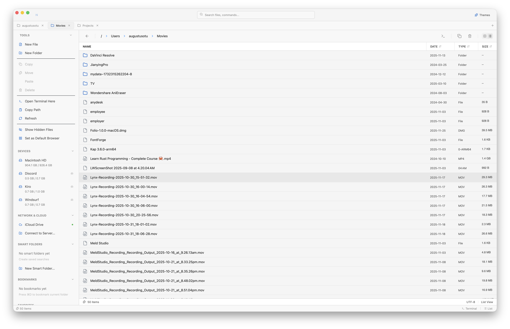
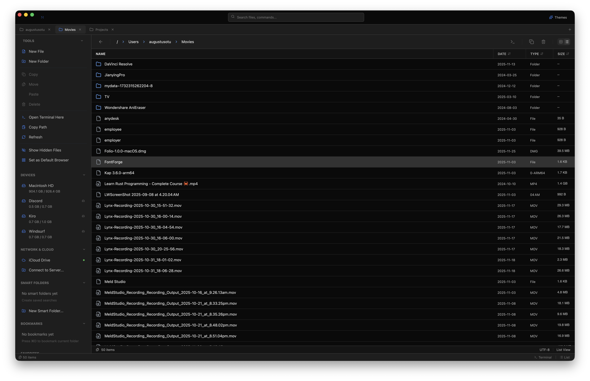
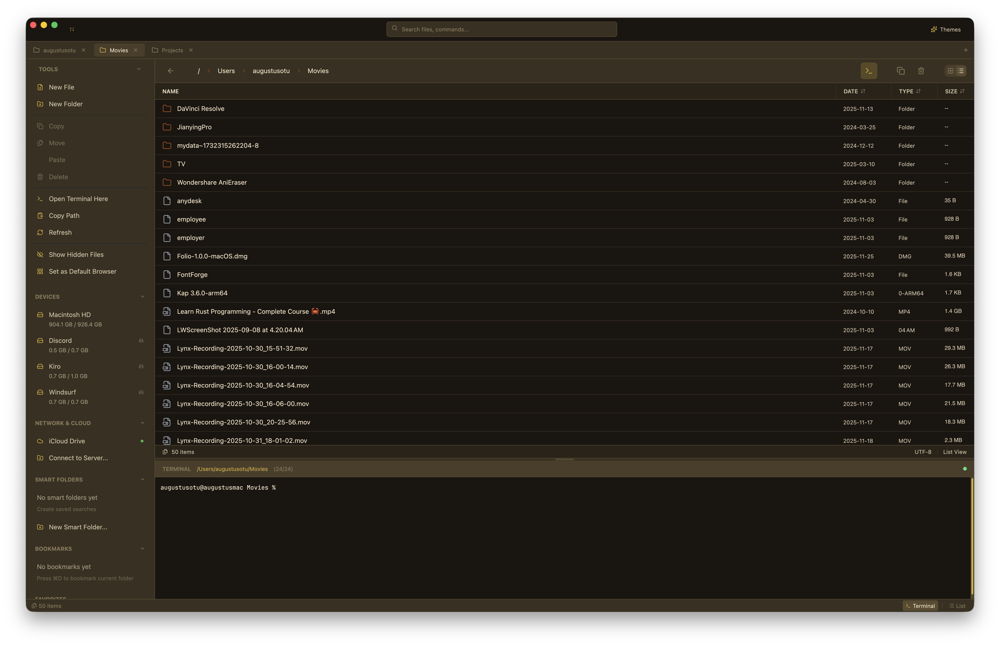

# Nexus Explorer

A blazing-fast, GPU-accelerated file explorer built with Rust and GPUI.


## Overview

Nexus Explorer is a next-generation file manager designed for speed. Built on the GPUI framework (from the Zed editor), it achieves sub-16ms response times by leveraging GPU acceleration and an asynchronous, non-blocking architecture.

**The UI never waits for the file system.** Directory contents appear instantly from cache while background workers reconcile with the disk.

## Features

- **GPU-Accelerated Rendering** - Smooth 120Hz scrolling through millions of files
- **Parallel Directory Traversal** - Uses `jwalk` for 4x faster scanning than traditional methods
- **Fuzzy Search** - Powered by `nucleo` (from Helix editor), up to 8x faster than fzf
- **Multiple View Modes** - List, Grid, Column, and Dual-Pane views
- **Quick Look** - Preview files without opening them
- **Integrated Terminal** - Full terminal emulator built-in
- **Smart Folders** - Save complex search queries as virtual folders
- **Tags & Favorites** - Organize files with color-coded tags
- **Tabs & Multi-Window** - Work with multiple locations simultaneously
- **Theme Support** - Light and dark themes with customization
- **Cross-Platform** - macOS, Windows, and Linux support

## Screenshots

### Light Mode


### Dark Mode


### Integrated Terminal


Each tab maintains its own terminal instance with full state preservation. The terminal automatically follows your folder navigation, eliminating the need to manually `cd` when browsing directories.

## Installation

### macOS

**Homebrew (recommended):**
```bash
brew tap augani/nexus-explorer
brew install nexus-explorer
```

**Or download the DMG:**
- [Apple Silicon (M1/M2/M3)](https://github.com/augani/nexus-explorer/releases/latest/download/NexusExplorer-aarch64-apple-darwin.dmg)
- [Intel](https://github.com/augani/nexus-explorer/releases/latest/download/NexusExplorer-x86_64-apple-darwin.dmg)

### Windows

**Scoop:**
```powershell
scoop bucket add nexus https://github.com/augani/nexus-explorer
scoop install nexus-explorer
```

**Or download:**
- [MSI Installer](https://github.com/augani/nexus-explorer/releases/latest/download/NexusExplorer-windows-x86_64.msi) (recommended)
- [ZIP Archive](https://github.com/augani/nexus-explorer/releases/latest/download/NexusExplorer-windows-x86_64.zip)

### Linux

**AppImage (universal):**
```bash
wget https://github.com/augani/nexus-explorer/releases/latest/download/NexusExplorer-linux-x86_64.AppImage
chmod +x NexusExplorer-linux-x86_64.AppImage
./NexusExplorer-linux-x86_64.AppImage
```

**Debian/Ubuntu:**
```bash
wget https://github.com/augani/nexus-explorer/releases/latest/download/NexusExplorer-linux-x86_64.deb
sudo dpkg -i NexusExplorer-linux-x86_64.deb
```

**Manual install:**
```bash
wget https://github.com/augani/nexus-explorer/releases/latest/download/NexusExplorer-linux-x86_64.tar.gz
tar -xzf NexusExplorer-linux-x86_64.tar.gz
cd nexus-explorer
sudo ./install.sh
```

### From Source

```bash
git clone https://github.com/augani/nexus-explorer.git
cd nexus-explorer
cargo build --release
./target/release/nexus-explorer
```

### Build Requirements

- Rust 1.75 or later
- macOS 12+, Windows 10+, or Linux with Vulkan support

**macOS:** Install Xcode command line tools:
```bash
xcode-select --install
```

**Linux:** Install dependencies:
```bash
# Ubuntu/Debian
sudo apt install libxcb1-dev libxkbcommon-dev libvulkan-dev

# Fedora
sudo dnf install libxcb-devel libxkbcommon-devel vulkan-loader-devel
```

## Usage

### Keyboard Shortcuts

| Action | macOS | Windows/Linux |
|--------|-------|---------------|
| Open | `⌘ + O` | `Ctrl + O` |
| New Folder | `⌘ + Shift + N` | `Ctrl + Shift + N` |
| New File | `⌘ + N` | `Ctrl + N` |
| Delete | `⌘ + Delete` | `Delete` |
| Copy | `⌘ + C` | `Ctrl + C` |
| Paste | `⌘ + V` | `Ctrl + V` |
| Cut | `⌘ + X` | `Ctrl + X` |
| Search | `⌘ + F` | `Ctrl + F` |
| Quick Look | `Space` | `Space` |
| Go to Folder | `⌘ + Shift + G` | `Ctrl + Shift + G` |
| Toggle Hidden | `⌘ + Shift + .` | `Ctrl + H` |
| New Tab | `⌘ + T` | `Ctrl + T` |
| Close Tab | `⌘ + W` | `Ctrl + W` |

### View Modes

- **List View** - Traditional detailed list with columns
- **Grid View** - Icon grid with thumbnails
- **Column View** - Miller columns for hierarchical navigation
- **Dual Pane** - Side-by-side file management

## Architecture

Nexus Explorer follows a strict separation between UI and I/O:

```
┌─────────────────────────────────────────────────────────┐
│                    Main Thread (UI)                      │
│  ┌─────────┐  ┌──────────┐  ┌─────────┐  ┌──────────┐  │
│  │Workspace│  │ FileList │  │ Sidebar │  │ Preview  │  │
│  └────┬────┘  └────┬─────┘  └────┬────┘  └────┬─────┘  │
│       │            │             │            │         │
│       └────────────┴─────────────┴────────────┘         │
│                         │                                │
│                    ┌────┴────┐                          │
│                    │ Models  │                          │
│                    └────┬────┘                          │
└─────────────────────────┼───────────────────────────────┘
                          │ async channels
┌─────────────────────────┼───────────────────────────────┐
│              Background Executor (GPUI)                  │
│                    ┌────┴────┐                          │
│                    │ Tasks   │                          │
│                    └────┬────┘                          │
└─────────────────────────┼───────────────────────────────┘
                          │ spawn_blocking
┌─────────────────────────┼───────────────────────────────┐
│                 Tokio Thread Pool                        │
│  ┌─────────┐  ┌──────────┐  ┌─────────┐  ┌──────────┐  │
│  │ jwalk   │  │  notify  │  │  icons  │  │  search  │  │
│  └─────────┘  └──────────┘  └─────────┘  └──────────┘  │
└─────────────────────────────────────────────────────────┘
```

### Key Design Principles

1. **No blocking on main thread** - All I/O happens in background threads
2. **Batched updates** - File entries are batched (100 items or 16ms) to prevent render thrashing
3. **Generational requests** - Stale results from previous navigations are discarded
4. **LRU caching** - Recently visited directories are cached for instant back-navigation
5. **Virtualized rendering** - Only visible rows are rendered, enabling millions of files

## Tech Stack

- **Language**: Rust
- **UI Framework**: GPUI (GPU-accelerated)
- **Async Runtime**: Tokio
- **Directory Traversal**: jwalk (parallel, work-stealing)
- **Search Engine**: nucleo (fuzzy matching)
- **File Watching**: notify (cross-platform)

## Contributing

Contributions are welcome! Please read our [Contributing Guide](CONTRIBUTING.md) before submitting a PR.

### Development Setup

```bash
# Clone with submodules
git clone --recursive https://github.com/augani/nexus-explorer.git

# Run tests
cargo test

# Run with debug logging
RUST_LOG=debug cargo run
```

### Code Style

- Run `cargo fmt` before committing
- Run `cargo clippy` and address warnings
- Add tests for new functionality

## Roadmap

- [ ] Windows NTFS USN Journal integration for instant search
- [ ] Linux io_uring support for maximum I/O throughput
- [ ] Cloud storage integration (S3, GCS, Azure)
- [ ] Plugin system for extensions
- [ ] Batch rename with regex support
- [ ] Archive creation and extraction
- [ ] Network drive support (SMB, NFS)

## License

This project is licensed under the MIT License - see the [LICENSE](LICENSE) file for details.

## Acknowledgments

- [GPUI](https://github.com/zed-industries/zed) - The GPU-accelerated UI framework
- [jwalk](https://github.com/jessegrosjean/jwalk) - Parallel directory traversal
- [nucleo](https://github.com/helix-editor/nucleo) - Fuzzy matching engine
- [adabraka-ui](https://github.com/adabraka/adabraka-ui) - UI component library

---

Built with ❤️ and Rust
